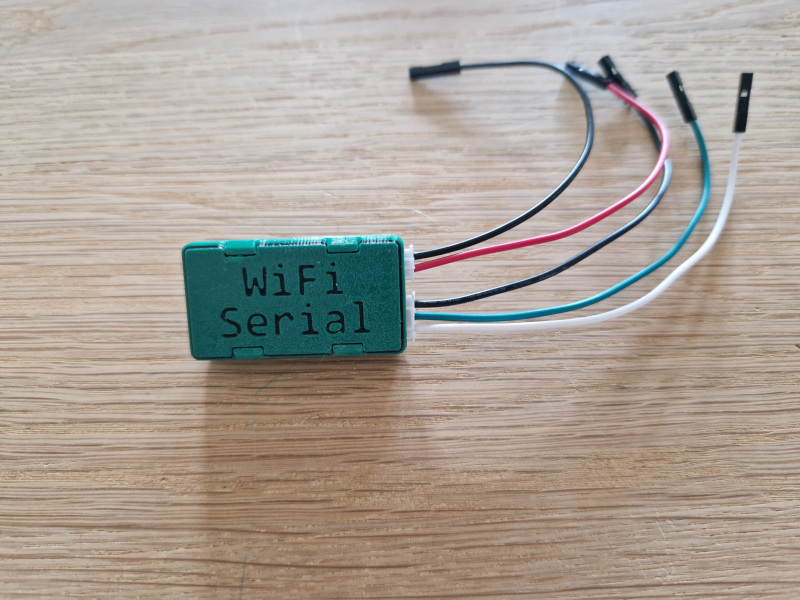
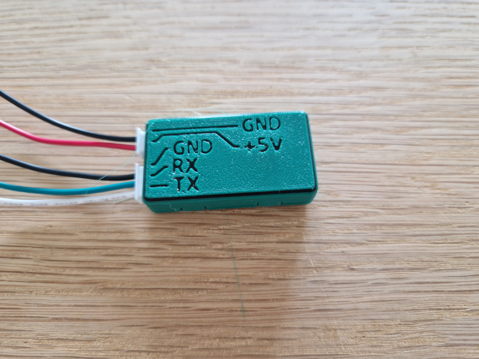
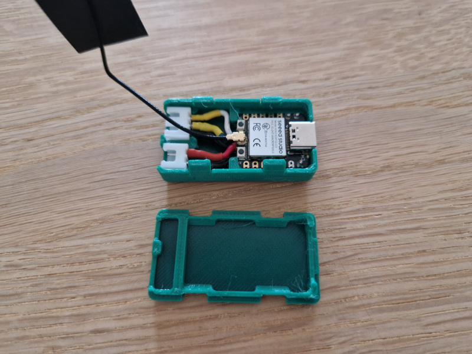
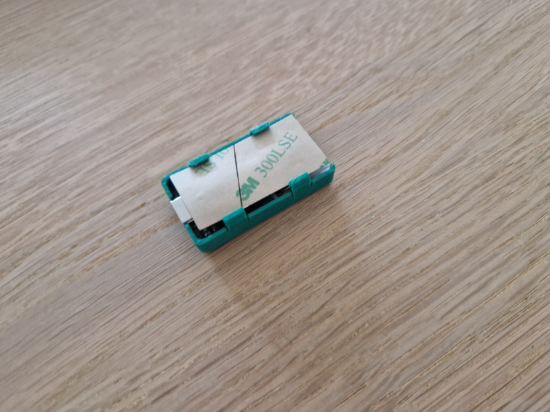
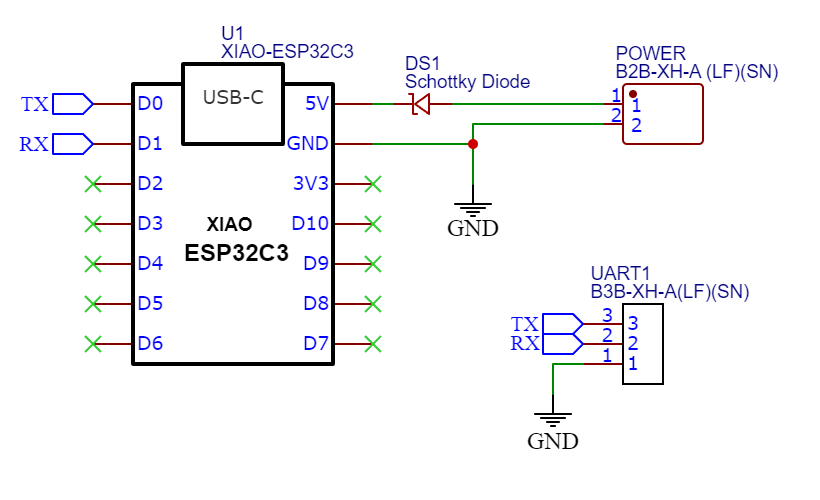

# WiFi serial bridge 

Wifi bridge for SeeedStudio XIAO ESP32-C3. 

* Connect to serial port via telnet
* Power either by USB-C port, or 5V connector.
* TODO Web server for configuration and terminal via websocket







# Configuration

The bridge can be configured by connecting the USB port to a PC, and starting a serial terminal program.

|Command|Description|
|---|---|
|wifi_join <ssid> <password>|Join WiFi network. SSID and password is stored on the device.|
|wifi_restore|Reset wifi configuration, and forget any stored SSID and password.|
|wifi_set_country <code>|Configure 2 letter WiFi country code|
|serial_baud <baud>|Set serial baud rate|
|help|Command help|


# Case 3D Model

* [Bottom](doc/WifiSerial-bottom.3mf)
* [Top](doc/WifiSerial-top.3mf)

# BOM

* Seed studio XIAO ESP32C3
* 3pin JST XH Connector
* 2pin JST XH Connector
* Schottky diode

# Schematic




# Development

Use PlatformIO plugin in Visual Studio Code

## Configure esp sdk
```
pio run -t menuconfig
```